<div align="center">

# NICOLAS FERNANDES

### Desenvolvedor em formação | Front-End Developer


<div align="center">



</div>

<div align="center">
 
   -
  </div>


## Sobre mim

Olá! Eu sou **Nicolas**, estudante de Informática e apaixonado por programação, tecnologia e desenvolvimento de projetos.
Atualmente, estou aprimorando minhas habilidades em **desenvolvimento Web**, trabalhando principalmente com **Java, JavaScript, HTML e CSS**. Tenho interesse em **Front-End**, buscando evoluir cada vez mais na criação de aplicações completas e funcionais.
Meu objetivo é continuar aprendendo novas tecnologias, desenvolver projetos e construir uma base sólida para atuar como **desenvolvedor Front-End**, sempre buscando melhorar minhas habilidades e conhecimentos.

> **“A mente que se abre a uma nova ideia jamais volta ao seu tamanho original.” — Albert Einstein**


## Tech Stack

<div align="center">

### Front-End


### Ferramentas


</div>

---

## Projetos


### JJN FLIX

Projeto de um site de cinema desenvolvido com foco em design,
responsividade e experiência do usuário.

Tecnologias:

`HTML` `CSS` `JavaScript`

---

## Atualmente estudando

```text
HTML
CSS
JavaScript
Java
Git
GitHub
```

---

<div align="center">


Anyone can wear the mask.

</div>

---

## Conecte-se comigo

<div align="center">

<a href="https://github.com/N1ckDev">

</a>

<a href="https://www.linkedin.com/">

</a>

</div>

---

<div align="center">


<br><br>

<div align="center">


</div>

</div>
